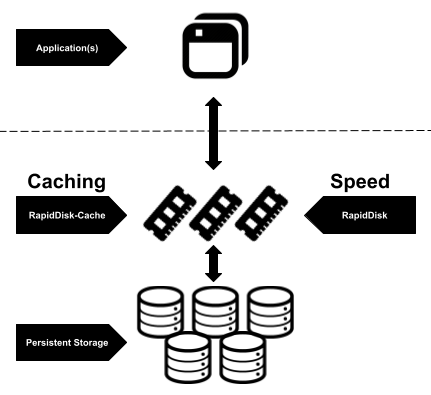

Author: Petros Koutoupis (<petros@petroskoutoupis.com>)

## About the RapidDisk Project

RapidDisk contains a set of advanced Linux RAM Drive and Caching kernel
modules. The user space utilities allow you to dynamically allocate RAM
as block devices to either use them as stand alone drives or even map
them as caching nodes to slower local (or remote) disk drives. The same
utilies provide users with the capability to export the same volumes
across an NVMe Target network.



### Caching Policies

Leverage a high speed RAM drive to add speed to a slower volume by
utilizing the (Linux native) Device-Mapper framework. Enable a Write /
Read-through or Write Around Least Recently Used or LRU (FIFO) cache.

#### Write-Through / Read-Through Caching

This is where an application treats cache as the main data store and
reads data from it and writes data to it. The cache is responsible for
reading and writing this data to the permanent storage volume, thereby
relieving the application of this responsibility.

In this mode, all writes are cached to a RapidDisk RAM drive but are also
written to disk immediately. All disk reads are cached. Cache is not persistent
over device removal, reboots, or after you remove the Device-Mapper mapping.
This module does not store any cache metadata on RapidDisk volumes but instead
in memory outside of RapidDisk. You can map and unmap a cache drive to any
volume at any time and it will not affect the integrity of the data on the
persistent storage drive.

#### Write-Around Caching

Write Around caching shares some similarities with the Write-Through
implementation. However, in this method, only read operations are cached
and not write operations. This way, all read data considered hot can
remain in cache a bit longer before being evicted.

### RESTful API

The RapidDisk Daemon (rapiddiskd) enabled remote management of RapidDisk
volumes. The management commands are simplified into a set of GET and POST
commands. It operates over port 9118 by default. This can be changed when
invoking the daemon with the use of a parameter. Either way, please
ensure that the port is open for TCP within your firewall rules.

An example of a GET command:

```console
# curl -s --output - 127.0.0.1:9118/v1/listRapidDiskVolumes|jq .
{
  "volumes": [
    {
      "rapiddisk": [
        {
          "device": "rd1",
          "size": 67108864
        },
        {
          "device": "rd0",
          "size": 67108864
        }
      ]
    },
    {
      "rapiddisk_cache": [
        {
          "device": "rc-wa_loop7",
          "cache": "rd0",
          "source": "loop7",
          "mode": "write-around"
        }
      ]
    }
  ]
}
```

An example of a POST command:

```console
# curl -X POST -s 127.0.0.1:9118/v1/createRapidDisk/128|jq .
{
  "status": "Success"
}
```

## Building and Installing the rapiddisk kernel modules and utilities

Change into the project's parent directory path.

> To build the rapiddisk management utility, you will need to have the
> `libjansson` and `libmicrohttpd` development library files installed
> on your host system.
>
> You are required to having either the full kernel source or the kernel
> headers installed for your current kernel revision.

To build rapiddisk from source, you would type the following on the command
line:

```console
# make
```

To install rapiddisk (must execute with superuser rights: `sudo`):

```console
# make install
```

To uninstall rapiddisk (must execute with superuser rights: `sudo`):

```console
# make uninstall
```

The rapiddisk utility will install in `/sbin/`

For utility information please reference the rapiddisk manual page:

```console
# man 1 rapiddisk
```

## Inserting/Removing the rapiddisk / rapiddisk-cache kernel modules
Both modules are required to be loaded for the rapiddisk daemon to start.

To insert the rapiddisk module:

```console
# modprobe rapiddisk
```

To remove the rapiddisk module:

```console
# modprobe -r rapiddisk
```

To insert the rapiddisk-cache module:

```console
# modprobe rapiddisk-cache
```

To remove the rapiddisk-cache module:

```console
# modprobe -r rapiddisk-cache
```

## Building and installing / uninstalling the tools ONLY

Installing:

```console
# make tools-install
```

Uninstalling:

```console
# make tools-uninstall
```

## Installing modules for DKMS support

```console
# make dkms-install
```

## Uninstalling modules for DKMS support

```console
# make dkms-uninstall
```

## Managing the RapidDisk daemon service

After installation, to start the service via systemd:

```console
# systemctl start rapiddiskd.service
```

To check the status of the service via systemd:

```console
# systemctl status rapiddiskd.service
```

To stop the service via systemd:

```console
# systemctl stop rapiddiskd.service
```

To start the service at boot via systemd:

```console
# systemctl enable rapiddiskd.service
```
